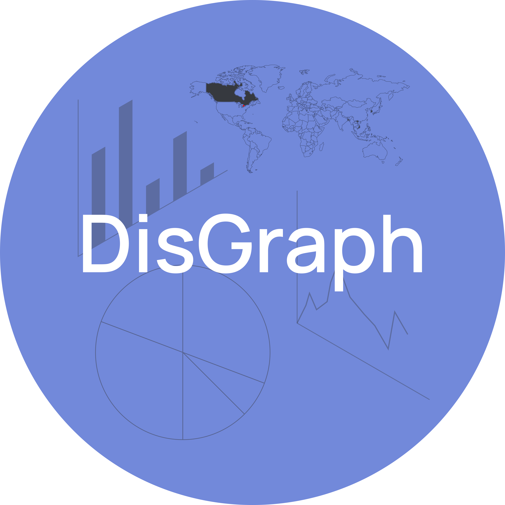

# DisGraph (HTN 2020++ Submission)

# Table of Contents
- [DisGraph (HTN 2020++ Submission)](#disgraph-htn-2020-submission)
- [Table of Contents](#table-of-contents)
- [About the Project](#about-the-project)
- [Getting Started](#getting-started)
  - [Requirements](#requirements)
  - [Installation](#installation)
- [Usage](#usage)
    - [Graph Types](#graph-types)
- [License](#license)
- [HTN 2020++ Group](#htn-2020-group)
# About the Project
Wanting to explore a unique way to share CSV/Excel data through the 
[Dropbase](https://dropbase.io) API, we thought about the platform through 
which we were all communicating on. Discord. So we decided to create `DisGraph`
, a Discord bot that can read in your data from a `.csv` and return a graph.

# Getting Started
At the moment the bot doesn't have a public link as it isn't hosted 24/7. But,
if you'd like to host the bot yourself you can.

## Requirements

- Python 3.8 or greater

## Installation

1. Clone the repo
   `git clone https://github.com/brandonnly/HTN-2020.git`
2. Install the required libraries
   `pip install -r requirements.txt`
3. Set up a [bot account](https://discordpy.readthedocs.io/en/latest/discord.html)
4. Set up your [Dropbase](https://dropbase.io) database with 4 tables (
   one for each dataset template
   )
    - x_vs_yy
    - name_vs_count
    - geodot
    - geospatial
5. Setup environment variables with your API keys
   - `BOT_TOKEN`
   - `DROPBASE_API_KEY`
   - `DROPBASE_ACCESS_KEY`
   - `X VS Y TABLE`
   - `NAME VS COUNT TABLE`
   - `GEODOT TABLE`
   - `GEOSPATIAL TABLE`

# Usage
There are a few options for graphs with one command. The CSV's must follow an
exact format as seen in `example_data`

The command is `d!graph {graph_type}`

### Graph Types
- yy-bar
  - CSV must have columns `x`, `y1`, `y2`
- yy-line
  - CSV must have columns `x`, `y1`, `y2`
- yy-scatter
  - CSV must have columns `x`, `y1`, `y2`
- y-pie
  - CSV must have columns `name`, `count`
- geodot
  - CSV must have columns `name`, `lat`, `lon`
- geospatial
  - CSV must have columns `lon_departure`, `lat_departure`, `lon_arrival`, `lat_arrival`

# License

This project is released under the MIT license, see `LICENSE` for more info.

# HTN 2020++ Group

Brandon Ly - [branonly.me](https://brandonly.me)

Jerome Philip - [LinkedIn](https://www.linkedin.com/in/jerome-philip/) - [jeromephilip.com/](http://jeromephilip.com/)

Farzad Rahman - [farzadr-dev.github.io/](https://farzadr-dev.github.io/)

Joonseo Lee - [LinkedIn](https://www.linkedin.com/in/joonsauce)